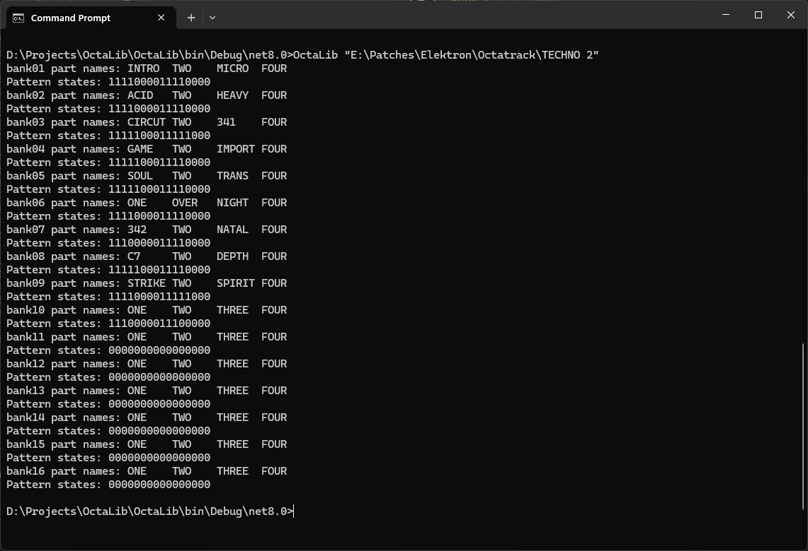
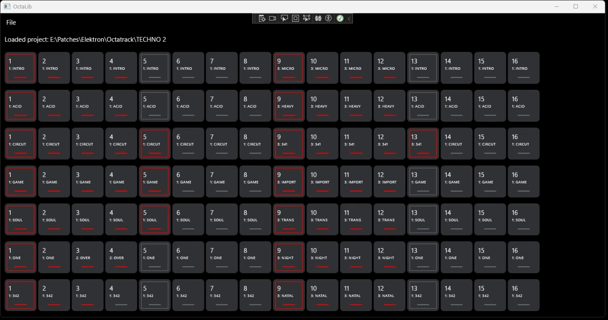

# OctaLib
OctaLib is a simple librarian app for the Elektron Octatrack.

Why should such a thing exist? While Octatrack is a great product, it's lacking some core librarian functionality, and to my knowledge, no such product exits today.

Some simple operations--such as swapping banks within a projects--can be done directly on the filesystem, but more advanced operations involve rewriting Octatrack's proprietary files in a way that is beyond the average user.

## Product Vision

OctaLib will be developed using a phased approach.

### Phase 1

Provide a basic view of a project, with the ability to swap banks *within* a project. This will include:

- A grid layout showing occupied banks and patterns
- Part numbers for each pattern
- Part names for each bank

Phase 1 is partially complete: `OctaLibConsole` can be used to view a crude visual representation of a project, as well as swap banks within a project.

OctaLibApp currently displays a visualization of the project, including part names for every pattern, and a UI for swapping will be provided next.

**Known issues:**
* The logic to determine if a pattern contains data is currently flawed--a pattern is only considered as having content if there's a regular (non recording) trig on page 1. 

### Phase 2

- Add more advanced operations, such as swapping parts and patterns *between* banks.

### Future

- Reordering project samples (this will require rewriting banks and markers)
- Creating new composite projects from existing banks (i.e. copy bank 1 from project A, bank 2 from project B, etc.)

## Repo Structure

This project is currently divided into three parts:

* `OctaLib`: a class library containing functions to query information about projects
* `OctaLibConsole`: a Windows console app mainly intended 
* `OctaLibApp`: a Windows UI app that will serve as the main application

For notes and findings re: reverse engineering the Octatrack file format, see [Research](Research.md).

