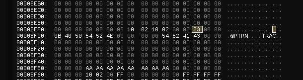
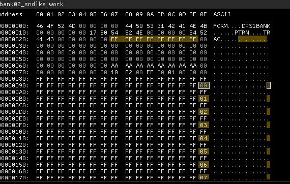
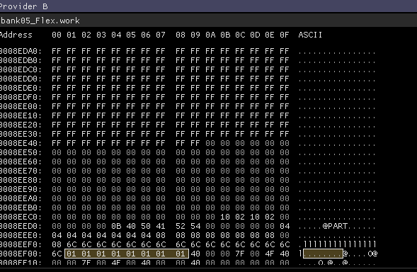

## Reverse Engineering

I have no intent to fully reverse engineer the file formats. If somebody else has done this, please consider sharing your findings with the community. My goal is to simply reverse engineer enough to achieve my immediate goals. 

### Project Files

An Octatrack project is compromised of 52 files:

- Project (1): `project`
- Arranger files (8): `arr01..arr08`
- Bank files (16): `bank01..bank16`
- Markers (1): `markers`

Each file has two versions: `.work` and `.strd`. My (untested but likely) assumption is that the `.strd` file is the "stored" (saved) file, and the `.work` is the working memory. Reloading a project likely replaces the `.work` with `.strd`, and saving does the inverse.

I will be largely ignoring the arranger and markers file for now. My assumption is that swapping banks will break arrangement references, but seeing as I don't use arrangements, I don't care enough to dig into this right now.

### The Project

Let's get the easy one out of the way first: the project file. This contains metadata about a project, including sample slot definitions, and it's the only project file stored in plain text.

I'm going to skip over the project metadata for now as it's not of interest to me.

#### Sample Definitions

The sample definitions are clearly delineated:
```
############################
# Samples
############################

<FLEX sample definitions>

<STATIC sample definitions>

############################
```

Sample definition format:
```
[SAMPLE]
TYPE=
SLOT=
PATH=
TRIM_BARSx100=
TSMODE=
LOOPMODE=
GAIN=
TRIGQUANTIZATION=
[/SAMPLE]

```

I can infer a few obvious things here but I'm not going to create a comprehensive list of all possible values at this time.

```
TYPE: FLEX or STATIC
SLOT: Slot number (001-128, plus 129-136 for FLEX)
PATH: ../path/to/file
TRIM_BARSx100: sample length in bars x100 (i.e 400=4 bars)
TSMODE: Time stretch mode
LOOPMODE: Loop mode
GAIN: Gain (default appears to be 48)
TRIGQUANTIZATION: Trig quantization (default appears to be -1)
```

Both lists are variable length, with up to 128 entries. The FLEX list has 8 special entries at the end (129-136) which I assume are for the recording buffers.

### Bank Files

My initial observations:

- It appears to be a fixed length file; this should make it easier to work with
- Unspecified values are padded with `FF`

Structurally, I see:

- A file header
- 16 PTRN (pattern) definitions containing
    - 8 TRAC definitions (tracks)
    - 8 MTRA definitions (MIDI tracks)
- A PART header
- The part names in plain text at the very end of the file

I also see this repeating pattern, which I assume is either a delineator, or some kind of metadata.

```
AA AA AA AA AA AA AA AA 00 00 00 00 00 00 00 00 10 02
```


#### Part References

The part reference is stored at the end of the pattern block:



In the example above, the part is set to 4.


#### Trig Data

Regular (non recording) trigs are stored at the following location in reverse binary format:



In the example above, all trigs are set.

TODO: Other trig types are stored a little bit later in the file but I have yet to dig into this.

#### Machine Types

Machine types are stored as consecutive bytes along with the part definition:




In the example above, all machines are set to flex, whereas I believe 00 is static (default)

TODO: Create a list of machine types -> codes.

### Project Files

Refer to the following file for a list of useful addresses:
https://github.com/snugsound/OctaLib/blob/main/OctaLib/Constants.cs

### Thanks

Special thanks to WiliWoW from the Elektronauts forums for his help with reverse engineering!